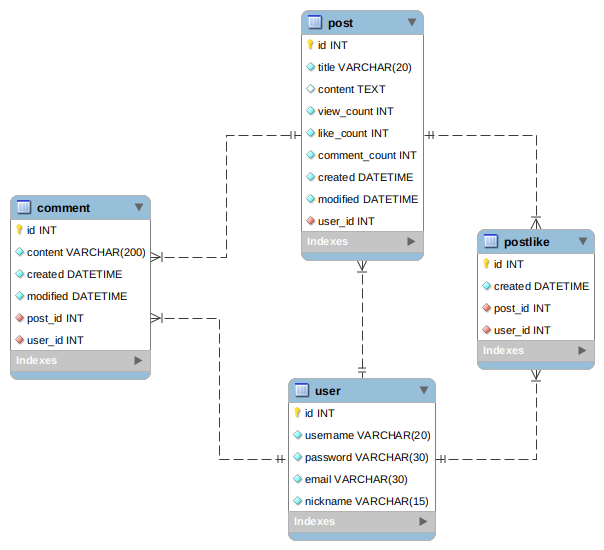

# 게시판 만들기

배운 내용을 복습하고  대부분의 사이트에는 게시판이 있기에 이걸 만들었습니다.

<br>

## 설치

```
pip install -r requirements/base.tx
```

<br>

## secrets

Root(bulletin_board 폴더) 밑에 `.secrets` 폴더를 만들고 각각의 파일을 설정합니다.

Root 폴더
└── .secret 폴더

`base.json`

```json
{
   "SECRET_KEY" : "<SECRET_KEY>",
    "EMAIL_HOST_USER": "<Google@gmail.com>",
    "EMAIL_HOST_PASSWORD": "<Gmail Password>"
}
```

`dev.json`

```
{
	"ALLOWED_HOSTS": []
}
```

`production.json`

```json
{
  "DATABASES": {
    "default": {
      "ENGINE": "<DB_ENGINE>",
      "HOST": "<HOST>",
      "NAME": "<DB_NAME>",
      "USER": "<DB_USER>",
      "PASSWORD": "<DB_PASSWORD>",
      "PORT": PORT
    }
  },
  "AWS_ACCESS_KEY_ID":"<ACCESS_KEY>",
  "AWS_SECRET_ACCESS_KEY":"<ACCESS_SECRET>",
  "AWS_STORAGE_BUCKET_NAME":"<BUCKETNAME>",
  "ALLOWED_HOSTS": []
}
```

<br>

## Model



<br>

## 기능

- 유저
  - 회원가입
  - 로그인(소셜 로그인은 로컬에서 되도록 구현)
- 포스트
  - 작성
  - 수정
  - 삭제
  - 좋아요
- 댓글
  - 작성
  - 수성
  - 삭제
- 그 외
  - 조건에 따른 글 검색
  - 페이지네이션
  - 회원가입 시 이메일 보내기/home/feynman/Pictures